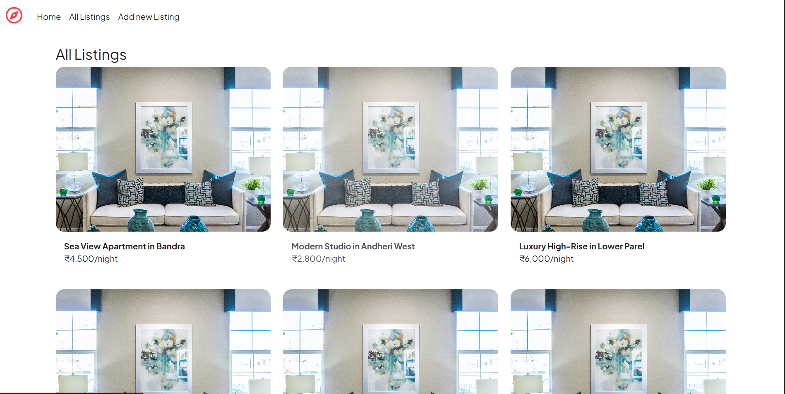
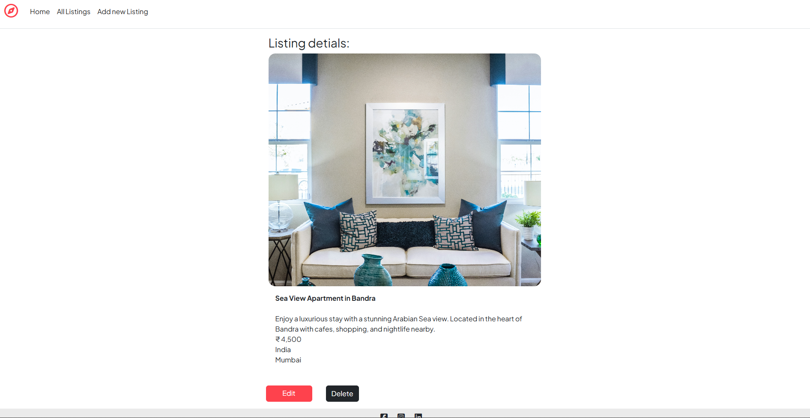
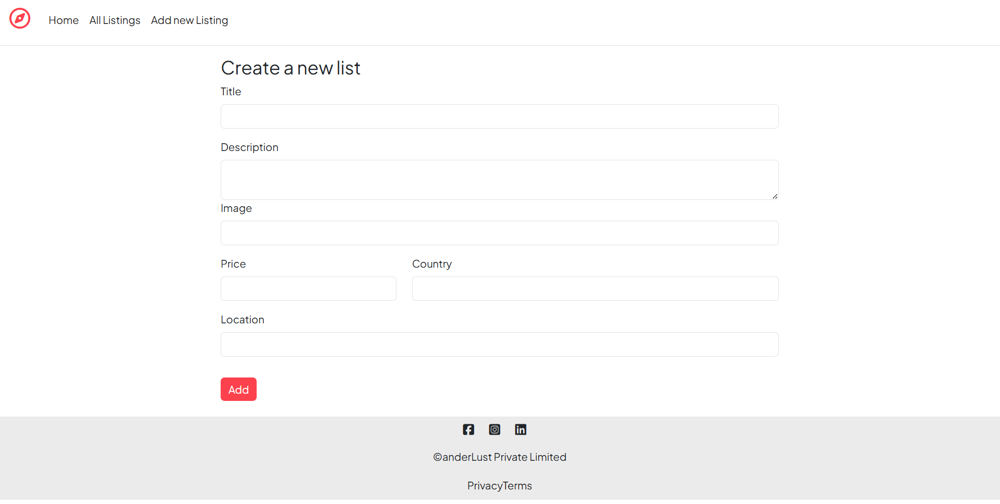

# 🌍 WanderLust (Magor Project)

A full-stack web application inspired by Airbnb, where users can explore, create, and manage property listings.

---

## 🚀 Features

* 🏠 Create, edit, and delete listings
* 📄 View detailed listing information
* 🖼️ Image support for listings
* 🎨 Clean UI using EJS templates and CSS
* 🗄️ MongoDB database integration

---

## 🖼️ Screenshots

### 🏠 Home Page



### 📄 Listing Details



### ➕ Create Listing



---

## 🛠️ Tech Stack

* **Frontend:** HTML, CSS, EJS
* **Backend:** Node.js, Express.js
* **Database:** MongoDB (Mongoose)

---

## 📁 Project Structure

```
magor-project/
│
├── models/         # Mongoose schemas
├── views/          # EJS templates
├── public/         # Static files (CSS, images)
├── init/           # Initial data scripts
├── screenshots/    # Project screenshots
├── app.js          # Main server file
├── package.json
└── README.md
```

---

## ⚙️ Installation & Setup

### 1. Clone the repository

```
git clone https://github.com/Harshpatil446/wanderLust.git
cd magor-project
```

---

### 2. Install dependencies

```
npm install
```

---

### 3. Setup environment variables

Create a `.env` file and add:

```
MONGO_URL=your_mongodb_connection_string
```

---

### 4. Run the application

```
node app.js
```

---

### 5. Open in browser

```
http://localhost:3000
```

---

## 🌐 Deployment

You can deploy this project using platforms like:

* Render
* Railway

Make sure to:

* Use a cloud MongoDB database (MongoDB Atlas)
* Set environment variables on the hosting platform

---

## 📌 Future Improvements

* 🔐 User authentication (login/signup)
* ⭐ Reviews and ratings
* 📍 Location-based search

---

## 🤝 Contributing

Contributions are welcome!
Feel free to fork this repo and submit a pull request.

---

## 📄 License

This project is for educational purposes.

---

## 👨‍💻 Author

**Harsh Patil**

---

⭐ If you like this project, don’t forget to star the repo!

